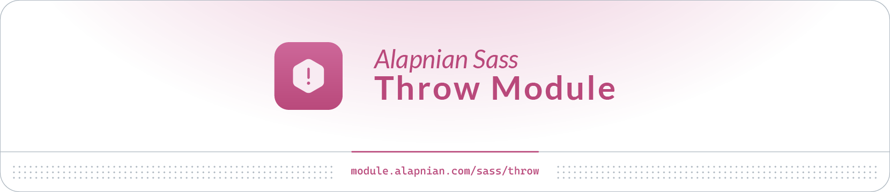

<p>
    <picture>
        <source srcset="banner.png" type="image/png">
        
    </picture>
</p><br>

<picture>
  <source srcset="https://fonts.gstatic.com/s/e/notoemoji/latest/1f680/512.webp" type="image/webp">
  
</picture>
<picture>
  <source srcset="https://fonts.gstatic.com/s/e/notoemoji/latest/1f680/512.webp" type="image/webp">
  
</picture>
<h1 align="center">Get Started</h1>

<h2>👁️ Overview</h2>
<p>
    Alapnian Sass Throw Module is provides Sass functions to standardize exception messages. In this module, there are 4 mixins and 2 functions that are ready for you to use, namely:
    <ul>
        <li>
            Mixins: <a href="#variable"><code>variable()</code></a>, <a href="#variable-type"><code>variable-type()</code></a>, <a href="#parameter"><code>parameter()</code></a>, <a href="#parameter-type"><code>parameter-type()</code></a>
        </li>
        <li>Functions: <a href="#parameter-1"><code>parameter()</code></a>, <a href="#parameter-type-1"><code>parameter-type()</code></a></li>
    </ul>
</p>


<h2>📋 Requirements</h2>
<p>
<ul>
    <li><a href="">Dart Sass</a>: <code>>=1.23.0</code></li>
</ul>
</p>

<h2>📥 Installations</h2>

<h3>Node Package Manager (NPM)</h3>
<p>
    <a target="_blank" title="NPM Version" href="https://www.npmjs.com/package/@alapnian-sass/throw?activeTab=versions"></a>
    <a target="_blank" title="NPM Downloads" href="javascript:void(0)"></a>
    <pre><code>npm i @alapnian-sass/throw</code></pre>
</pre>
</p>

<h2>👨🏻‍💻 Usage</h2>

<p>After the package has been installed, it might already be available for use just like any other Sass module.</p>

```scss
@use '@alapnian-sass/throw';
```

<p>However, if Sass can't find the module, your compiler will need to be configured to include the <code>node_modules</code> folder. That should look something like this:</p>

```js
const sass = require('sass');

sass.compile(filePath, {
  loadPaths: ['node_modules']
});
```

<h2>⚙️ Settings</h2>

<table>
    <caption>Alapnian Sass Throw Module Settings</caption>
    <thead>
        <tr>
            <th>Name</th>
            <th>Type</th>
            <th>Default</th>
            <th>Description</th>
        </tr>
    </thead>
    <tbody>
        <tr>
            <td><code>$strict-mode</code></td>
            <td>Boolean</td>
            <td><code>true</code></td>
            <td>Description</td>
        </tr>
    </tbody>
</table>

<p>
Customize settings via <a target="_blank" href=""><code>@forward</code> rule</a>:

```scss
@forward "@alapnian-sass/throw" with (
    $strict-mode: false
);
```

Customize settings via <a><code>@use</code> rule</a>:

```scss
@use "@alapnian-sass/throw" with (
    $strict-mode: false
);
```
</p>

<picture>
  <source srcset="https://fonts.gstatic.com/s/e/notoemoji/latest/1f525/512.webp" type="image/webp">
  
</picture>
<picture>
  <source srcset="https://fonts.gstatic.com/s/e/notoemoji/latest/1f525/512.webp" type="image/webp">
  
</picture>
<h1 align="center">API</h1>

<h2>🌀 Mixins</h2>

<h3>variable()</h3>

```scss
throw.variable($message, $names...);

throw-variable($message, $names...);
```

<p>An error message stating an issue with one or more variables.</p>
<p>When the <code>$strict-mode</code> parameter (or global <code>$strict-mode</code> setting) is set, the mixin will output errors as comments without stopping compilation.</p>

<p>
    <strong>Parameters:</strong>
</p>
<p>
<table>
    <caption><code>throw.variable()</code> Mixin Parameters</caption>
    <thead>
        <tr>
            <th>Name</th>
            <th>Type</th>
            <th>Default</th>
            <th>Description</th>
        </tr>
    </thead>
    <tbody>
        <tr>
            <td><code>$message</code></td>
            <td>String</td>
            <td></td>
            <td>The message which describes the issue.</td>
        </tr>
        <tr>
            <td><code>$names</code></td>
            <td>ArgList</td>
            <td></td>
            <td>The names of the variables for which there is an issue.</td>
        </tr>
        <tr>
            <td><code>$strict-mode</code></td>
            <td>Boolean</td>
            <td><code>%derived%</code></td>
            <td>Optionally catch errors and output them as CSS comments without stopping compilation.</td>
        </tr>
    </tbody>
</table>
</p>

<p>
    <strong>Output:</strong><br>
    A string describing the reason one or more variables are misconfigured.
</p>

<p>
    <strong>Example:</strong>
    <details>
        <summary>Basic</summary>

```scss
// Load modules
@use "@alapnian-sass/throw";

// Define vars
$width: 1080px !default;

// Validate
@if ($width < 0) {
    @include throw.variable("Value must not be less than zero, but is `#{$width}`", "width");
}
```
</details>
    <details>
        <summary>Advanced</summary>

```scss
// Load modules
@use "@alapnian-sass/throw";

// Define vars
$width: 1080px !default;

// Validate
@if ($width < 0) {
    @include throw.variable("Value must not be less than zero, but is `#{$width}`", "width", $strict-mode: false);
}
```

<p>Or, you can set <code>$strict-mode</code> when u load <code>@use</code> rule with <code>with</code></p>

```scss
// Load modules
@use "@alapnian-sass/throw" with ($strict-mode: false);

// Define vars
$width: 1080px !default;

// Validate
@if ($width < 0) {
    @include throw.variable("Value must not be less than zero, but is `#{$width}`", "width");
}
```
</details>
</p>

<h3>variable-type()</h3>

```scss
throw.variable-type($name, $value, $types...);

throw-variable-type($name, $value, $types...);
```

<p>An error message stating a variable received the wrong type.</p>
<p>When the <code>$strict-mode</code> parameter (or global <code>$strict-mode</code> setting) is set, the mixin will output errors as comments without stopping compilation.</p>

<p>
    <strong>Parameters:</strong>
</p>
<p>
    <table>
        <caption><code>throw.variable-type()</code> Mixin Parameters</caption>
        <thead>
            <tr>
                <th>Name</th>
                <th>Type</th>
                <th>Default</th>
                <th>Description</th>
            </tr>
        </thead>
        <tbody>
            <tr>
                <td><code>$name</code></td>
                <td>String</td>
                <td></td>
                <td>The name of the variable which has received the wrong type.</td>
            </tr>
            <tr>
                <td><code>$value</code></td>
                <td>*</td>
                <td></td>
                <td>The value which was received.</td>
            </tr>
            <tr>
                <td><code>$types</code></td>
                <td>ArgList</td>
                <td></td>
                <td>The types which are expected.</td>
            </tr>
            <tr>
                <td><code>$message</code></td>
                <td>String</td>
                <td><code>null</code></td>
                <td>The additional message which describes the issue. Must be passed by name.</td>
            </tr>
            <tr>
                <td><code>$strict-mode</code></td>
                <td>Boolean</td>
                <td><code>%derived%</code></td>
                <td>Optionally catch errors and output them as CSS comments without stopping compilation.</td>
            </tr>
        </tbody>
    </table>
</p>

<p>
    <strong>Output:</strong><br>
    A string describing what types are acceptable for a variable and the value that is misconfigured.
</p>

<p>
    <strong>Example:</strong>
    <details>
        <summary>Basic</summary>

```scss
// Load modules
@use "@alapnian-sass/meta";
@use "@alapnian-sass/throw";

// Define vars
$width: 1080px !default;

// Validate
@if (meta.type-of($width) != "number") {
    @include throw.variable("width", $width, "number");
}
```
</details>
    <details>
        <summary>Advanced</summary>

```scss
// Load modules
@use "@alapnian-sass/throw";

// Define vars
$width: 1080px !default;

// Validate
@if (meta.type-of($width) != "number") {
    @include throw.variable("width", $width, "number", $strict-mode: false, $message: "Please use the number value type.");
}
```

<p>Or, you can set <code>$strict-mode</code> when u load <code>@use</code> rule with <code>with</code></p>

```scss
// Load modules
@use "@alapnian-sass/throw" with ($strict-mode: false);

// Define vars
$width: 1080px !default;

// Validate
@if (meta.type-of($width) != "number") {
    @include throw.variable("width", $width, "number", $message: "Please use the number value type.");
}
```
</details>
</p>

<h3>parameter()</h3>

```scss
throw.parameter($message, $context, $names...);

throw-parameter($message, $context, $names...);
```

<p>An error message stating an issue with one or more parameters.</p>
<p>When the <code>$strict-mode</code> parameter (or global <code>$strict-mode</code> setting) is set, the mixin will output errors as comments without stopping compilation.</p>

<p>
    <strong>Parameters:</strong>
</p>
<p>
    <table>
        <caption><code>throw.parameter()</code> Mixin Parameters</caption>
        <thead>
            <tr>
                <th>Name</th>
                <th>Type</th>
                <th>Default</th>
                <th>Description</th>
            </tr>
        </thead>
        <tbody>
            <tr>
                <td><code>$message</code></td>
                <td>String</td>
                <td></td>
                <td>The message which describes the issue.</td>
            </tr>
            <tr>
                <td><code>$context</code></td>
                <td>String</td>
                <td></td>
                <td>The name of the mixin issuing the error.</td>
            </tr>
            <tr>
                <td><code>$names</code></td>
                <td>ArgList</td>
                <td></td>
                <td>The names of the parameters for which there is an issue.</td>
            </tr>
            <tr>
                <td><code>$strict-mode</code></td>
                <td>Boolean</td>
                <td><code>%derived%</code></td>
                <td>Optionally catch errors and output them as CSS comments without stopping compilation.</td>
            </tr>
        </tbody>
    </table>
</p>

<p>
    <strong>Output:</strong><br>
    A string describing the reason one or more parameters are invalid.
</p>

<p>
    <strong>Example:</strong>
    <details>
        <summary>Basic</summary>

```scss
// Load modules
@use "sass:meta";
@use "@alapnian-sass/throw";

// Reflexive Position Mixin
@mixin reflexive-position($property, $value) {
    @if $property != left and $property != right {
        @include throw.parameter("Property #{$property} must be either left or right.", "property")
    } @else {
        @if (meta.type-of($value) != "number") {
            @include throw.parameter-type("reflexive-position", "value", $value);
        } @else {
            $left-value: $value;
            @if ($property == right) {
                $left-value: initial;
            }
            
            $right-value: initial;
            @if ($property == right) {
                $right-value: $value;
            }

            left: $left-value;
            right: $right-value;

            [dir=rtl] & {
                left: $right-value;
                right: $left-value;
            }
        }
    }
}

.valid-property {
    @include reflexive-position("left", 12px);
}

.invalid-property {
    @include reflexive-position("top", 12px);
}
```
</details>
    <details>
        <summary>Advanced</summary>

```scss
// Load modules
@use "sass:meta";
@use "@alapnian-sass/throw";

// Reflexive Position Mixin
@mixin reflexive-position($property, $value) {
    @if $property != left and $property != right {
        @include throw.parameter("Property #{$property} must be either left or right.", "property", $strict-mode: false)
    } @else {
        @if (meta.type-of($value) != "number") {
            @include throw.parameter-type("reflexive-position", "value", $value);
        } @else {
            $left-value: $value;
            @if ($property == right) {
                $left-value: initial;
            }
            
            $right-value: initial;
            @if ($property == right) {
                $right-value: $value;
            }

            left: $left-value;
            right: $right-value;

            [dir=rtl] & {
                left: $right-value;
                right: $left-value;
            }
        }
    }
}

.valid-property {
    @include reflexive-position("left", 12px);
}

.invalid-property {
    @include reflexive-position("top", 12px);
}
```

<p>Or, you can set <code>$strict-mode</code> when u load <code>@use</code> rule with <code>with</code></p>

```scss
// Load modules
@use "sass:meta";
@use "@alapnian-sass/throw" with ($strict-mode: false);

// Reflexive Position Mixin
@mixin reflexive-position($property, $value) {
    @if $property != left and $property != right {
        @include throw.parameter("Property #{$property} must be either left or right.", "property")
    } @else {
        @if (meta.type-of($value) != "number") {
            @include throw.parameter-type("reflexive-position", "value", $value);
        } @else {
            $left-value: $value;
            @if ($property == right) {
                $left-value: initial;
            }
            
            $right-value: initial;
            @if ($property == right) {
                $right-value: $value;
            }

            left: $left-value;
            right: $right-value;

            [dir=rtl] & {
                left: $right-value;
                right: $left-value;
            }
        }
    }
}

.valid-property {
    @include reflexive-position("left", 12px);
}

.invalid-property {
    @include reflexive-position("top", 12px);
}
```
</details>
</p>

<h3>parameter-type()</h3>

```scss
throw.parameter-type($context, $name, $value, $types...);

throw-parameter-type($context, $name, $value, $types...);
```

<p>An error message stating a parameter received the wrong type.</p>
<p>When the <code>$strict-mode</code> parameter (or global <code>$strict-mode</code> setting) is set, the mixin will output errors as comments without stopping compilation.</p>

<p>
    <strong>Parameters:</strong>
</p>
<p>
    <table>
        <caption><code>throw.parameter()</code> Mixin Parameters</caption>
        <thead>
            <tr>
                <th>Name</th>
                <th>Type</th>
                <th>Default</th>
                <th>Description</th>
            </tr>
        </thead>
        <tbody>
            <tr>
                <td><code>$context</code></td>
                <td>String</td>
                <td></td>
                <td>The name of the mixin issuing the error.</td>
            </tr>
            <tr>
                <td><code>$name</code></td>
                <td>String</td>
                <td></td>
                <td>The name of the parameter which has received the wrong type.</td>
            </tr>
            <tr>
                <td><code>$value</code></td>
                <td>*</td>
                <td></td>
                <td>The value which was received.</td>
            </tr>
            <tr>
                <td><code>$types</code></td>
                <td>ArgList</td>
                <td></td>
                <td>The types which are expected.</td>
            </tr>
            <tr>
                <td><code>$message</code></td>
                <td>String</td>
                <td><code>null</code></td>
                <td>The additional message which describes the issue. Must be passed by name.</td>
            </tr>
            <tr>
                <td><code>$strict-mode</code></td>
                <td>Boolean</td>
                <td><code>%derived%</code></td>
                <td>Optionally catch errors and output them as CSS comments without stopping compilation.</td>
            </tr>
        </tbody>
    </table>
</p>

<p>
    <strong>Output:</strong><br>
    A string describing what types are acceptable for a parameter and the value that is invalid.
</p>

<p>
    <strong>Example:</strong>
    <details>
        <summary>Basic</summary>

```scss
// Load modules
@use "sass:meta";
@use "@alapnian-sass/throw";

// Reflexive Position Mixin
@mixin reflexive-position($property, $value) {
    @if $property != left and $property != right {
        @include throw.parameter("Property #{$property} must be either left or right.", "property")
    } @else {
        @if (meta.type-of($value) != "number") {
            @include throw.parameter-type("reflexive-position", "value", $value);
        } @else {
            $left-value: $value;
            @if ($property == right) {
                $left-value: initial;
            }
            
            $right-value: initial;
            @if ($property == right) {
                $right-value: $value;
            }

            left: $left-value;
            right: $right-value;

            [dir=rtl] & {
                left: $right-value;
                right: $left-value;
            }
        }
    }
}

.valid-value {
    @include reflexive-position("left", 12px);
}

.invalid-value {
    @include reflexive-position("left", "12px");
}
```
</details>
    <details>
        <summary>Advanced</summary>

```scss
// Load modules
@use "sass:meta";
@use "@alapnian-sass/throw";

// Reflexive Position Mixin
@mixin reflexive-position($property, $value) {
    @if $property != left and $property != right {
        @include throw.parameter("Property #{$property} must be either left or right.", "property")
    } @else {
        @if (meta.type-of($value) != "number") {
            @include throw.parameter-type("reflexive-position", "value", $value, $strict-mode: false, $message: "Please use the number value type.");
        } @else {
            $left-value: $value;
            @if ($property == right) {
                $left-value: initial;
            }
            
            $right-value: initial;
            @if ($property == right) {
                $right-value: $value;
            }

            left: $left-value;
            right: $right-value;

            [dir=rtl] & {
                left: $right-value;
                right: $left-value;
            }
        }
    }
}

.valid-value {
    @include reflexive-position("left", 12px);
}

.invalid-value {
    @include reflexive-position("left", "12px");
}
```

<p>Or, you can set <code>$strict-mode</code> when u load <code>@use</code> rule with <code>with</code></p>

```scss
// Load modules
@use "sass:meta";
@use "@alapnian-sass/throw" with($strict-mode: false);

// Reflexive Position Mixin
@mixin reflexive-position($property, $value) {
    @if $property != left and $property != right {
        @include throw.parameter("Property #{$property} must be either left or right.", "property")
    } @else {
        @if (meta.type-of($value) != "number") {
            @include throw.parameter-type("reflexive-position", "value", $value, $message: "Please use the number value type.");
        } @else {
            $left-value: $value;
            @if ($property == right) {
                $left-value: initial;
            }
            
            $right-value: initial;
            @if ($property == right) {
                $right-value: $value;
            }

            left: $left-value;
            right: $right-value;

            [dir=rtl] & {
                left: $right-value;
                right: $left-value;
            }
        }
    }
}

.valid-value {
    @include reflexive-position("left", 12px);
}

.invalid-value {
    @include reflexive-position("left", "12px");
}
```
</details>
</p>

<h2>🧩 Functions</h2>

<h3>parameter()</h3>

```scss
throw.parameter($message, $context, $names...); //=> String | any

throw-parameter($message, $context, $names...); //=> String | any
```

<p>Returns an error message stating an issue with one or more variables.</p>
<p>When the <code>$strict-mode</code> parameter (or global <code>$strict-mode</code> setting) is set, the function will return errors without stopping compilation.</p>

<p>
    <strong>Parameters:</strong>
</p>
<p>
    <table>
        <caption><code>throw.parameter()</code> Function Parameters</caption>
        <thead>
            <tr>
                <th>Name</th>
                <th>Type</th>
                <th>Default</th>
                <th>Description</th>
            </tr>
        </thead>
        <tbody>
            <tr>
                <td><code>$message</code></td>
                <td>String</td>
                <td></td>
                <td>The message which describes the issue.</td>
            </tr>
            <tr>
                <td><code>$context</code></td>
                <td>String</td>
                <td></td>
                <td>The name of the function issuing the error.</td>
            </tr>
            <tr>
                <td><code>$names</code></td>
                <td>ArgList</td>
                <td></td>
                <td>The names of the variables for which there is an issue.</td>
            </tr>
            <tr>
                <td><code>$strict-mode</code></td>
                <td>Boolean</td>
                <td><code>%derived%</code></td>
                <td>Optionally catch errors and return them as values without stopping compilation.</td>
            </tr>
            <tr>
                <td><code>$default-value</code></td>
                <td>any</td>
                <td></td>
                <td>Default return value when running in non-strict mode.</td>
            </tr>
        </tbody>
    </table>
</p>

<p>
    <strong>Return Value:</strong><br>
    <dl>
        <dt><code>String</code> | any</dt>
        <dd>A string describing the reason one or more variables are misconfigured.</dd>
    </dl>
</p>

<p>
    <strong>Example:</strong>
    <details>
        <summary>Basic</summary>

```scss
// Load modules
@use "sass:map";
@use "sass:list";
@use "@alapnian-sass/throw";

@function from($pairs...) {
    @if (list.length($pairs) < 1) {
        @return throw.parameter("One or more key/value pairs are required", "from", "pairs");
    }

    $result: ();

    @each $key, $value in $pairs {
        $result: map.set($result, $key, $value);
    }

    @return $result;
}

// Valid
@debug from(01234567890);
@debug from(rgba(19, 7, 24, 1));
@debug from([24px 7px, 19px]);
@debug from((regular: 400, medium: 500, bold: 700));

// Invalid
@debug from();
```
</details>
    <details>
        <summary>Advanced</summary>

```scss
// Load modules
@use "sass:map";
@use "sass:list";
@use "@alapnian-sass/throw";

@function from($pairs...) {
    @if (list.length($pairs) < 1) {
        @return throw.parameter("One or more key/value pairs are required", "from", "pairs", $strict-mode: false, $default-value: null);
    }

    $result: ();

    @each $key, $value in $pairs {
        $result: map.set($result, $key, $value);
    }

    @return $result;
}

// Valid
@debug from(01234567890);
@debug from(rgba(19, 7, 24, 1));
@debug from([24px 7px, 19px]);
@debug from((regular: 400, medium: 500, bold: 700));

// Invalid
@debug from(); //=> null
```

<p>Or, you can set <code>$strict-mode</code> when u load <code>@use</code> rule with <code>with</code></p>

```scss
// Load modules
@use "sass:map";
@use "sass:list";
@use "@alapnian-sass/throw" with ($strict-mode: false);

@function from($pairs...) {
    @if (list.length($pairs) < 1) {
        @return throw.parameter("One or more key/value pairs are required", "from", "pairs", $default-value: null);
    }

    $result: ();

    @each $key, $value in $pairs {
        $result: map.set($result, $key, $value);
    }

    @return $result;
}

// Valid
@debug from(01234567890);
@debug from(rgba(19, 7, 24, 1));
@debug from([24px 7px, 19px]);
@debug from((regular: 400, medium: 500, bold: 700));

// Invalid
@debug from(); //=> null
```
</details>
</p>

<h3>parameter-type()</h3>

```scss
throw.parameter-type($context, $name, $value, $types...); //=> String | any

throw-parameter-type($context, $name, $value, $types...); //=> String | any
```

<p>Returns an error message stating a parameter received the wrong type.</p>
<p>When the <code>$strict-mode</code> parameter (or global <code>$strict-mode</code> setting) is set, the function will return errors without stopping compilation.</p>

<p>
    <strong>Parameters:</strong>
</p>
<p>
    <table>
        <caption><code>throw.parameter-type()</code> Function Parameters</caption>
        <thead>
            <tr>
                <th>Name</th>
                <th>Type</th>
                <th>Default</th>
                <th>Description</th>
            </tr>
        </thead>
        <tbody>
            <tr>
                <td><code>$context</code></td>
                <td>String</td>
                <td></td>
                <td>The name of the function issuing the error.</td>
            </tr>
            <tr>
                <td><code>$name</code></td>
                <td>String</td>
                <td></td>
                <td>The name of the parameter which has received the wrong type.</td>
            </tr>
            <tr>
                <td><code>$value</code></td>
                <td>*</td>
                <td></td>
                <td>The value which was received.</td>
            </tr>
            <tr>
                <td><code>$types</code></td>
                <td>ArgList</td>
                <td></td>
                <td>The types which are expected.</td>
            </tr>
            <tr>
                <td><code>$strict-mode</code></td>
                <td>Boolean</td>
                <td><code>%derived%</code></td>
                <td>Optionally catch errors and return them as values without stopping compilation.</td>
            </tr>
            <tr>
                <td><code>$message</code></td>
                <td>String</td>
                <td><code>null</code></td>
                <td>The additional message which describes the issue. Must be passed by name.</td>
            </tr>
            <tr>
                <td><code>$default-value</code></td>
                <td>any</td>
                <td></td>
                <td>Default return value when running in non-strict mode.</td>
            </tr>
        </tbody>
    </table>
</p>

<p>
    <strong>Return Value:</strong><br>
    <dl>
        <dt><code>String</code> | any</dt>
        <dd>A string describing what types are acceptable for a parameter and the value that is invalid.</dd>
    </dl>
</p>

<p>
    <strong>Example:</strong>
    <details>
        <summary>Basic</summary>

```scss
// Load modules
@use "sass:meta";
@use "sass:math";
@use "sass:color";
@use "@alapnian-sass/throw";

@function is-dark($color) {
    @if (meta.type-of($color) != "color") {
        @return throw.parameter-type("is-dark", "color", $color, "color");
    }

    @return math.div(color.red($color) * 299 + color.green($color) * 587 + color.blue($color) * 114, 1000) < 128;
}

// Valid
@debug is-dark(#000); //=> true
@debug is-dark(#FFF); //=> false

// Invalid
@debug is-dark("#000");
@debug is-dark("rgb(0,0,0)");
```
</details>
    <details>
        <summary>Advanced</summary>

```scss
// Load modules
@use "sass:meta";
@use "sass:math";
@use "sass:color";
@use "@alapnian-sass/throw";

@function is-dark($color) {
    @if (meta.type-of($color) != "color") {
        @return throw.parameter-type("is-dark", "color", $color, "color", $strict-mode: false, $message: "Please use color value types such as `rgb()`, `hsl()`, or other color models.", $default-value: false);
    }

    @return math.div(color.red($color) * 299 + color.green($color) * 587 + color.blue($color) * 114, 1000) < 128;
}

// Valid
@debug is-dark(#000); //=> true
@debug is-dark(#FFF); //=> false

// Invalid
@debug is-dark("#000"); //=> false
@debug is-dark("rgb(0,0,0)"); //=> false
```

<p>Or, you can set <code>$strict-mode</code> when u load <code>@use</code> rule with <code>with</code></p>

```scss
// Load modules
@use "sass:meta";
@use "sass:math";
@use "sass:color";
@use "@alapnian-sass/throw" with ($strict-mode: false);

@function is-dark($color) {
    @if (meta.type-of($color) != "color") {
        @return throw.parameter-type("is-dark", "color", $color, "color", $message: "Please use color value types such as `rgb()`, `hsl()`, or other color models.", $default-value: false);
    }

    @return math.div(color.red($color) * 299 + color.green($color) * 587 + color.blue($color) * 114, 1000) < 128;
}

// Valid
@debug is-dark(#000); //=> true
@debug is-dark(#FFF); //=> false

// Invalid
@debug is-dark("#000"); //=> false
@debug is-dark("rgb(0,0,0)"); //=> false
```
</details>
</p>